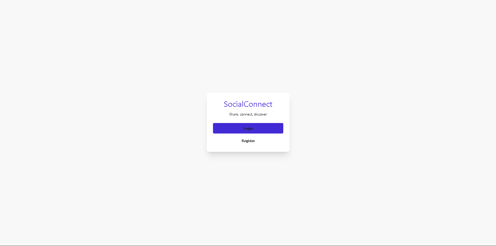
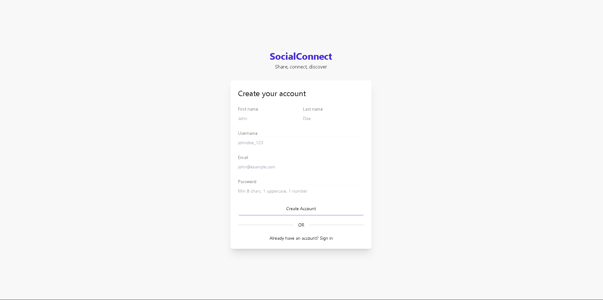
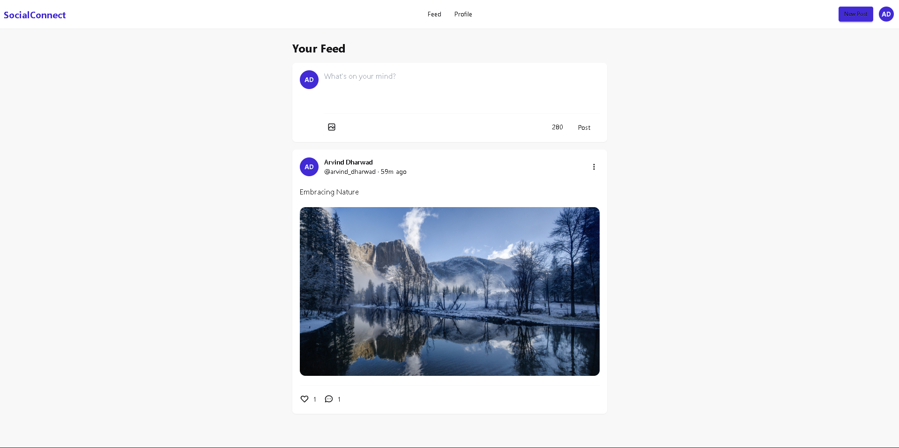
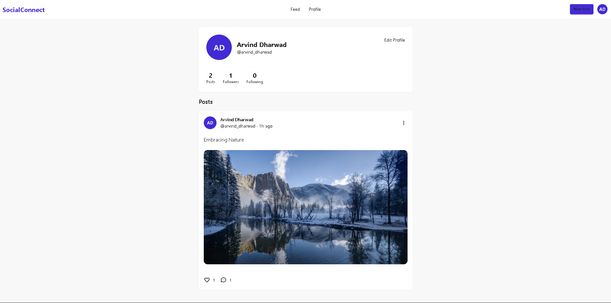

# SocialConnect

A full-stack social media application where users can share posts, connect with others, and discover content through a personalised feed.

> Built with Next.js 14, TypeScript, Supabase, and DaisyUI.

## Live Demo

[https://social-connect-alpha-lemon.vercel.app](https://social-connect-alpha-lemon.vercel.app)

## Screenshots






## Tech Stack

| Layer          | Technology                |
| -------------- | ------------------------- |
| Framework      | Next.js 14 (App Router)   |
| Language       | TypeScript                |
| Database       | PostgreSQL via Supabase   |
| Authentication | Custom JWT using jose     |
| File Storage   | Supabase Storage          |
| UI             | Tailwind CSS v3 + DaisyUI |
| Deployment     | Vercel                    |

## Features

- JWT-based authentication (register, login, logout)
- User profiles with avatar upload
- Create, edit, and delete posts (text + single image)
- Like and unlike posts
- Comment system
- Public chronological feed with pagination
- Follow and unfollow users
- Personalised feed for logged-in users

## Repository Structure

```
SocialConnect/
└── socialconnect/    ← The Next.js application
    ├── src/
    │   ├── app/          → Pages and API routes
    │   ├── components/   → Reusable UI components
    │   ├── hooks/        → Custom React hooks
    │   ├── lib/          → Utilities and config
    │   └── types/        → TypeScript interfaces
    ├── public/           → Static assets
    └── README.md         → Detailed project documentation
```

## Prerequisites

Before you begin make sure you have:

- [Node.js 18+](https://nodejs.org/) installed
- [Git](https://git-scm.com/) installed
- A [Supabase](https://supabase.com) account (free tier works)
- A [Vercel](https://vercel.com) account for deployment (optional)

## Installation

### 1. Clone the repository

```bash
git clone https://github.com/Arvind-DHub/SocialConnect.git
cd SocialConnect/socialconnect
```

### 2. Install dependencies

```bash
npm install
```

### 3. Set up Supabase

1. Go to [supabase.com](https://supabase.com) and create a new project
2. Go to **Project Settings → API** and copy:
   - Project URL
   - anon/public key
   - service_role key
3. Go to **SQL Editor** and run the full schema from `src/app/api/README.md`
4. Go to **Storage** and create a public bucket named `socialconnect-media`

### 4. Generate a JWT secret

Go to [https://generate-secret.vercel.app/32](https://generate-secret.vercel.app/32) and copy the generated string.

### 5. Create `.env.local`

Create a file called `.env.local` inside the `socialconnect/` folder:

```env
NEXT_PUBLIC_SUPABASE_URL=https://your-project-id.supabase.co
NEXT_PUBLIC_SUPABASE_ANON_KEY=your_anon_key_here
SUPABASE_SERVICE_ROLE_KEY=your_service_role_key_here
JWT_SECRET=your_generated_secret_here
```

> ⚠️ Never commit this file to Git. It is already listed in `.gitignore`.

### 6. Run the development server

```bash
npm run dev
```

Open [http://localhost:3000](http://localhost:3000) in your browser.

### 7. Build for production (optional)

```bash
npm run build
npm start
```

## Environment Variables

| Variable                        | Description                         | Exposed to Browser        |
| ------------------------------- | ----------------------------------- | ------------------------- |
| `NEXT_PUBLIC_SUPABASE_URL`      | Your Supabase project URL           | Yes (safe)                |
| `NEXT_PUBLIC_SUPABASE_ANON_KEY` | Supabase anon/public key            | Yes (safe, RLS protected) |
| `SUPABASE_SERVICE_ROLE_KEY`     | Supabase admin key — full DB access | No (server only)          |
| `JWT_SECRET`                    | Secret key for signing JWT tokens   | No (server only)          |

## Deployment

This app is deployed on Vercel.

### Deploy your own

1. Push your code to GitHub
2. Go to [vercel.com](https://vercel.com) → New Project → Import your repo
3. Set **Root Directory** to `socialconnect`
4. Add all four environment variables in the Vercel dashboard
5. Click Deploy

Every subsequent `git push` to `main` triggers an automatic redeployment.

## API Endpoints

| Method | Endpoint                      | Auth | Description                 |
| ------ | ----------------------------- | ---- | --------------------------- |
| POST   | `/api/auth/register`          | No   | Create account              |
| POST   | `/api/auth/login`             | No   | Login                       |
| POST   | `/api/auth/logout`            | No   | Logout                      |
| GET    | `/api/auth/me`                | Yes  | Get current user            |
| GET    | `/api/users`                  | No   | List users                  |
| GET    | `/api/users/:id`              | No   | Get profile                 |
| PATCH  | `/api/users/me`               | Yes  | Update profile              |
| POST   | `/api/users/me/avatar`        | Yes  | Upload avatar               |
| GET    | `/api/posts`                  | No   | List posts                  |
| POST   | `/api/posts`                  | Yes  | Create post                 |
| GET    | `/api/posts/:id`              | No   | Get post                    |
| PATCH  | `/api/posts/:id`              | Yes  | Update post                 |
| DELETE | `/api/posts/:id`              | Yes  | Delete post                 |
| POST   | `/api/posts/:id/like`         | Yes  | Like post                   |
| DELETE | `/api/posts/:id/like`         | Yes  | Unlike post                 |
| GET    | `/api/posts/:id/comments`     | No   | List comments               |
| POST   | `/api/posts/:id/comments`     | Yes  | Add comment                 |
| DELETE | `/api/posts/:id/comments/:id` | Yes  | Delete comment              |
| GET    | `/api/feed`                   | No   | Public or personalised feed |
| POST   | `/api/users/:id/follow`       | Yes  | Follow user                 |
| DELETE | `/api/users/:id/follow`       | Yes  | Unfollow user               |
| GET    | `/api/users/:id/followers`    | No   | Get followers               |
| GET    | `/api/users/:id/following`    | No   | Get following               |

## Key Design Decisions

**Soft deletes** — Posts are never hard deleted. `is_active = false` hides them while preserving data integrity.

**Denormalized counts** — `like_count`, `comment_count`, and `posts_count` are stored on the parent row and kept in sync by PostgreSQL triggers. No expensive COUNT queries.

**JWT authentication** — Stateless tokens scale without shared session storage. Tokens expire after 7 days.

**Two Supabase clients** — `supabase` (anon, browser-safe) and `supabaseAdmin` (service role, server-only). The admin client never reaches the browser.

**Zod validation** — All inputs validated at the API boundary before touching the database.

## License

MIT
